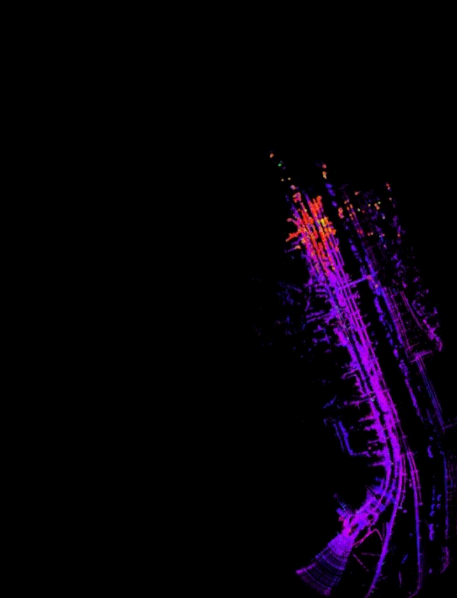

# Voxel-fast-lio2

**Abstract**;

This project was proposed to address the issues inherent in the basic fastlio2 algorithm. 
The algorithm resolves computational cost problems by incorporating voxelization and pass-through filters into the fundamental fastlio2. 
In the actual experiment, utilizing the alpha prime LiDAR in an outdoor environment, it was observed that the algorithm could not sustain beyond 1km, leading to a forced CPU shutdown.
However, the proposed method successfully performs flawless map generation during a 3.2km drive. 
This achievement underscores its exceptional potential for future outdoor map generation algorithm designs.


**Related papers**: 
FAST-LIO2: Fast Direct LiDAR-inertial Odometry

## ROS environment construction

Noted:

A. This project was tested in the Ubuntu 18.04 and ROS melodic environment.

B. Please prepare a PC with Ubuntu 18.04 installed.

Clone the repository and catkin_make:

## 1. Source list & key setting
```
    sudo sh -c 'echo "deb http://packages.ros.org/ros/ubuntu $(lsb_release -sc) main" > /etc/apt/sources.list.d/ros-latest.list'​
    sudo apt-key adv --keyserver 'hkp://keyserver.ubuntu.com:80' --recv-key C1CF6E31E6BADE8868B172B4F42ED6FBAB17C654​
...

## 2. Package update
...
    sudo apt update
...

## 3. ROS-melodic installation
...
    sudo apt install ros-melodic-desktop-full
...

## 4. Environment construction
...
    echo "source /opt/ros/melodic/setup.bash" >> ~/.bashrc
    source ~/.bashrc
...

## 5. Tool installation for package
...
    sudo apt-get install python-rosinstall python-rosinstall-generator python-wstool build-essential
...

## 6. ROS installation and initalization
...
    sudo apt-get install python-pip
    sudo pip install -U rosdep
    sudo rosdep init
    rosdep update
```


## FAST-LIO 2.0
<!--  -->

<div align="left">

</div>

### 1. Build from source
Clone the repository and catkin_make:

```
    cd ~/$A_ROS_DIR$/src
    git clone https://github.com/joonhyeok1002/Voxel-fast-lio2.git
    cd FAST_LIO
    git submodule update --init
    cd ../..
    catkin_make
    source devel/setup.bash
```
- Remember to source the livox_ros_driver before build (follow 1.3 **livox_ros_driver**)
- If you want to use a custom build of PCL, add the following line to ~/.bashrc
```export PCL_ROOT={CUSTOM_PCL_PATH}```

## 2. Preparation
Noted:

A. Please make sure the IMU and LiDAR are **Synchronized**, that's important.

B. The warning message "Failed to find match for field 'time'." means the timestamps of each LiDAR points are missed in the rosbag file. That is important for the forward propagation and backwark propagation.

C. We recommend to set the **extrinsic_est_en** to false if the extrinsic is give. As for the extrinsic initiallization, please refer to our recent work: [**Robust Real-time LiDAR-inertial Initialization**](https://github.com/hku-mars/LiDAR_IMU_Init).

## 3. Velodyne LiDAR example

Step A: Setup before run

Edit ``` config/velodyne.yaml ``` to set the below parameters:

1. LiDAR point cloud topic name: ``` lid_topic ```
2. IMU topic name: ``` imu_topic ``` (both internal and external, 6-aixes or 9-axies are fine)
3. Set the parameter ```timestamp_unit``` based on the unit of **time** (Velodyne) field in PoindCloud2 rostopic
4. Line number (we tested 16, 32, and 128 line): ``` scan_line ```
5. Translational extrinsic: ``` extrinsic_T ```
6. Rotational extrinsic: ``` extrinsic_R ``` (only support rotation matrix)
- The extrinsic parameters in FAST-LIO is defined as the LiDAR's pose (position and rotation matrix) in IMU body frame (i.e. the IMU is the base frame).

Step B: Run below
```
    cd ~/$Voxel-fast-lio2$
    source devel/setup.bash
    roslaunch pcl_tester voxel_grid_filtering.launch
    roslaunch fast_lio mapping_velodyne.launch
```

Step C: Run LiDAR's ros driver or play rosbag.
```
    rosbag play xxx-your-bagfile.bag
```


